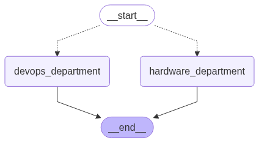

# Customer Support Workflow

This project implements a simple customer support workflow using LangGraph to route and handle support requests for different departments (DevOps and Hardware).

---

## Architecture(graph)


---

## Overview

The workflow is designed to:
- Accept a support request with a specified department and message.
- Route the request to the appropriate department (DevOps or Hardware) based on the input.
- Generate a tailored response for the request.

The code uses a `StateGraph` from the `langgraph` library to manage the workflow state and direct the flow of requests.

## Features

- **Routing Logic**: Routes requests to either the DevOps or Hardware department based on the `department` field in the input.
- **DevOps Department**: Responds to DevOps-related issues, such as restarting a Docker image.
- **Hardware Department**: Responds to hardware-related issues, requesting additional information like available RAM for diagnostics.
- **State Management**: Uses a `TypedDict` to maintain the state (`department`, `message`, `response`) throughout the workflow.

---

## Usage

1. **Define the Workflow**:
   - The workflow is defined using `StateGraph` from the `langgraph` library.
   - Nodes represent the DevOps and Hardware departments.
   - Conditional edges route the request from the `START` node to the appropriate department based on the `department` field.
   - Each department node processes the request and generates a response.

2. **Run the Workflow**:
   - Compile the workflow using `workflow.compile()`.
   - Invoke the workflow with an input dictionary containing `department` and `message`.

   Example for a Hardware issue:
   ```python
   response = graph_compile.invoke(
       {
           "department": "hardware",
           "message": "Hey PowerBI is running really slow on my PC",
       }
   )
   print(response)
   ```

   Example for a DevOps issue:
   ```python
   response = graph_compile.invoke(
       {
           "department": "devops",
           "message": "Hey chatwoot is not working",
       }
   )
   print(response)
   ```

3. **Output**:
   - The workflow returns a dictionary containing the `department`, `message`, and `response`.
   - Example output for Hardware:
     ```json
     {
         "department": "hardware",
         "message": "Hey PowerBI is running really slow on my PC",
         "response": "I've noted your message: 'Hey PowerBI is running really slow on my PC'.\nTo assist you further, could you please let me know the available RAM on your PC? This will help me diagnose the issue more accurately."
     }
     ```
   - Example output for DevOps:
     ```json
     {
         "department": "devops",
         "message": "Hey chatwoot is not working",
         "response": "Thanks for reaching out regarding: 'Hey chatwoot is not working'.\nI've just received your request and will restart the Docker image now. Once it's back up, I'll confirm that everything is running smoothly."
     }
     ```

---

## Code Structure

- **`Graphstate`**: A `TypedDict` defining the state structure with `department`, `message`, and `response` fields.
- **`router`**: A function that routes the request to the appropriate department based on the `department` field.
- **`devops_department`**: A function that processes DevOps requests and generates a response.
- **`hardware_department`**: A function that processes Hardware requests and generates a response.
- **`workflow`**: A `StateGraph` instance that defines the nodes and edges of the workflow.
- **`graph_compile`**: The compiled workflow ready to process inputs.