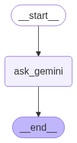

# Simple Q&A Workflow with LangGraph and Google Gemini

This folder implements a simple question-and-answer workflow using LangGraph and the Google Gemini model to process user queries.

---

## Overview

The workflow is designed to:
- Accept a user query (message).
- Process the query using a Google Gemini model via a LangChain prompt template.
- Return a concise response generated by the model.
- Visualize the workflow as a graph using Mermaid.

The code uses `StateGraph` from the `langgraph` library to manage the workflow and integrates with `langchain_google_genai` for query processing.

---

## Architecture


---

## Features

- **Query Processing**: Uses a `ChatPromptTemplate` to structure the input and a Google Gemini model (`gemini-2.5-flash`) to generate responses.
- **State Management**: Maintains a simple state with `message` and `response` fields using a `TypedDict`.
- **Visualization**: Generates a visual representation of the workflow using Mermaid, displayed via `IPython.display`.
- **Concise Responses**: Configures the model with a low temperature (0.1) for focused and deterministic outputs.

---

## Requirements
Additional to packages mentioned in pyproject.toml, you need a Google API key for the Gemini model. Set it in a `.env` file:

```plaintext
GOOGLE_API_KEY=your_api_key_here
```

---

## Usage

1. **Set Up Environment**:
   - Create a `.env` file in the project directory and add your Google API key.
   - Load the environment variables using `load_dotenv()`.

2. **Define the Workflow**:
   - The workflow is defined using `StateGraph` from the `langgraph` library.
   - A single node (`ask_gemini`) processes the user query using the Gemini model.
   - Edges connect the `START` to the `ask_gemini` node and then to the `END`.

3. **Run the Workflow**:
   - Compile the workflow using `workflow.compile()`.
   - Invoke the workflow with an input dictionary containing the `message`.

   Example:
   ```python
   response = graph_compile.invoke({"message": "what is machine learning?"})
   print(response["response"].content)
   ```

4. **Visualize the Workflow**:
   - Display the workflow graph in a Jupyter notebook using:
     ```python
     from IPython.display import Image, display
     display(Image(graph_compile.get_graph().draw_mermaid_png()))
     ```

5. **Output**:
   - The workflow returns a dictionary containing the `message` and `response`.
   - Example output for the query "what is machine learning?":
     ```json
     {
         "message": "what is machine learning?",
         "response": "<Gemini model's response content>"
     }
     ```
   - Print the response content:
     ```python
     print(response["response"].content)
     ```

---

## Code Structure

- **`Graphstate`**: A `TypedDict` defining the state structure with `message` and `response` fields.
- **`prompt`**: A `ChatPromptTemplate` that structures the input with a system message for concise responses.
- **`model`**: A `ChatGoogleGenerativeAI` instance using the `gemini-2.5-flash` model with a temperature of 0.1.
- **`model_chain`**: A LangChain pipeline combining the prompt and model.
- **`ask_gemini`**: A function that processes the user query and updates the state with the model's response.
- **`workflow`**: A `StateGraph` instance defining the node and edges.
- **`graph_compile`**: The compiled workflow ready to process inputs.

---

## Notes

- The workflow requires a valid Google API key for the Gemini model.
- The visualization feature (`draw_mermaid_png`) is designed for Jupyter notebooks. For non-notebook environments, you may need to save the graph to a file or use an alternative visualization method.
- The model’s temperature is set to 0.1 for concise and deterministic responses. Adjust the temperature in the `ChatGoogleGenerativeAI` configuration if more creative responses are desired.