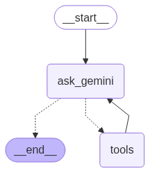

# Product Recommendation Workflow with LangGraph and Google Gemini

This folder implements a product recommendation workflow using LangGraph and the Google Gemini model to recommend products based on user queries or engage in casual conversation.

---

## Overview

The workflow is designed to:
- Accept a user query (message) and determine if it requests a product recommendation or is a general question.
- Use a custom `product_recommendation` tool to suggest products for specific categories (e.g., "jeans" or "shirt").
- Process general queries (e.g., "What is machine learning?") using the Google Gemini model.
- Visualize the workflow as a graph using Mermaid.

The code leverages `StateGraph` from the `langgraph` library to manage the workflow, integrates with `langchain_google_genai` for query processing, and uses a `ToolNode` to handle product recommendations.

---

## Architecture


---

## Features

- **Product Recommendations**: Recommends products for predefined categories (jeans, shirts) using a custom tool.
- **General Query Handling**: Responds to non-product-related queries with concise answers from the Gemini model.
- **Conditional Routing**: Routes queries to either the `tools` node for product recommendations or directly to the end for general responses.
- **State Management**: Uses `MessagesState` to maintain a conversation history with `messages`.
- **Visualization**: Generates a workflow graph using Mermaid, displayed via `IPython.display`.
- **Concise Responses**: Configures the Gemini model with a low temperature (0.1) for focused outputs.

---

## Requirements

Set up a Google API key for the Gemini model in a `.env` file:

```plaintext
GOOGLE_API_KEY=your_api_key_here
```

---

## Usage

1. **Set Up Environment**:
   - Create a `.env` file in the project directory with your Google API key.
   - Load environment variables using `load_dotenv()`.

2. **Define the Workflow**:
   - The workflow uses `StateGraph` with `MessagesState` to manage conversation state.
   - Nodes: `ask_gemini` (processes queries with Gemini) and `tools` (handles product recommendations).
   - Conditional edges route queries from `ask_gemini` to either `tools` (if a tool call is detected) or `END`.
   - The `tools` node loops back to `ask_gemini` to process tool outputs.

3. **Run the Workflow**:
   - Compile the workflow using `workflow.compile()`.
   - Invoke with an input dictionary containing a `messages` key with the user query.

   Example for product recommendation (jeans):
   ```python
   response = graph_compile.invoke({"messages": "can you recommend a jeans"})
   print(response["messages"][-1].content)
   ```

   Example for general query:
   ```python
   response = graph_compile.invoke({"messages": "Hello, what is machine learning?"})
   print(response["messages"][-1].content)
   ```

4. **Visualize the Workflow**:
   - Display the workflow graph in a Jupyter notebook:
     ```python
     from IPython.display import Image, display
     display(Image(graph_compile.get_graph().draw_mermaid_png()))
     ```

5. **Output**:
   - The workflow returns a dictionary with a `messages` list containing the query and response.
   - Example output for jeans:
     ```json
     {
         "messages": [
             "can you recommend a jeans",
             {
                 "content": "Here are some recommended jeans: Slim Fit Blue Jeans, Regular Fit Black Jeans, Distressed Denim Jeans, Tapered Fit Grey Jeans",
                 ...
             }
         ]
     }
     ```
   - Example output for a general query:
     ```json
     {
         "messages": [
             "Hello, what is machine learning?",
             {
                 "content": "<Gemini model's response about machine learning>",
                 ...
             }
         ]
     }
     ```

---

## Code Structure

- **`prompt`**: A `ChatPromptTemplate` with a system message instructing the model to recommend products or answer concisely.
- **`product_recommendation`**: A custom tool that returns product recommendations for categories like "jeans" or "shirt."
- **`model`**: A `ChatGoogleGenerativeAI` instance using the `gemini-2.5-flash` model with a temperature of 0.1.
- **`tools` and `tool_node`**: A list of tools and a `ToolNode` to process tool calls.
- **`model_chain`**: A LangChain pipeline combining the prompt and model with tool-binding.
- **`ask_gemini`**: A function that processes queries using the Gemini model and updates the state.
- **`router`**: A function that routes based on whether the last message contains a tool call.
- **`workflow`**: A `StateGraph` instance defining nodes and edges.
- **`graph_compile`**: The compiled workflow ready to process inputs.

---

## Notes

- The workflow requires a valid Google API key for the Gemini model.
- The `product_recommendation` tool currently supports only "jeans" and "shirt" categories. Add more categories to the `recommendations` dictionary to expand support.
- The visualization feature (`draw_mermaid_png`) is designed for Jupyter notebooks. For non-notebook environments, consider saving the graph to a file.
- The model’s temperature is set to 0.1 for deterministic responses. Adjust in `ChatGoogleGenerativeAI` for more creative outputs if needed.